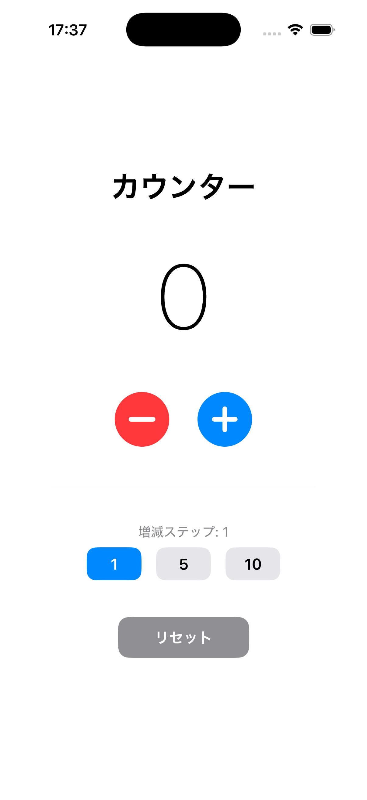

# Counter App

Swift / SwiftUI で開発したシンプルなiOSカウンターアプリです。

## 機能

- カウントの増減（＋ / ー ボタン）
- 増減ステップの切替（1 / 5 / 10）
- リセットボタン
- カウント値に応じた色変化（正: 青 / 負: 赤 / ゼロ: デフォルト）
- スプリングアニメーション付きの数値表示

## スクリーンショット

> iPhone シミュレータ（iOS）で実行した画面。カウント値・増減ステップ切替（1 / 5 / 10）・リセットボタンを備えています。

## 動作環境

| 項目 | バージョン |
|------|------------|
| iOS | 16.0 以上 |
| Xcode | 15.0 以上 |
| Swift | 5.9 以上 |

## ビルド方法

1. `CounterApp.xcodeproj` を Xcode で開く
2. シミュレーターまたは実機を選択
3. `⌘ + R` でビルド・実行

## 技術スタック

- **Swift** / **SwiftUI**
- `@State` によるリアクティブなUI管理
- `Animation(.spring())` によるカウント値アニメーション

## ライセンス

MIT License
